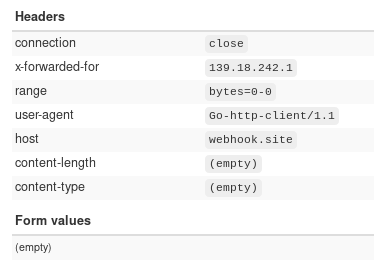
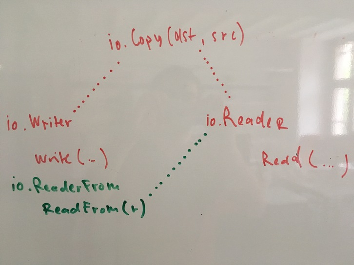

# Beautiful (and strange) I/O

Lightning Talk, Go and Cloud Native Leipzig https://golangleipzig.space
Martin Czygan
@BasislagerCo, 2019-06-14, 19:00

----

# Go Proverb

* [The bigger the interface, the weaker the abstraction](https://youtu.be/PAAkCSZUG1c?t=5m18s)


> More of theses at https://go-proverbs.github.io/

----

# Exemplified in package io

Generic I/O with `io.Reader` and `io.Writer` and a few other interfaces.

> https://golang.org/pkg/io/


----

|                    | R | W | C | S |
|--------------------|---|---|---|---|
| io.Reader          | x |   |   |   |
| io.Writer          |   | x |   |   |
| io.Closer          |   |   | x |   |
| io.Seeker          |   |   |   | x |
| io.ReadWriter      | x | x |   |   |
| io.ReadCloser      | x |   | x |   |
| io.ReadSeeker      | x |   |   | x |
| io.WriteCloser     |   | x | x |   |
| io.WriteSeeker     |   | x |   | x |
| io.ReadWriteCloser | x | x | x |   |
| io.ReadWriteSeeker | x | x |   | x |

----

# Missing things

Libraries might implement missing pieces, e.g.

* [ReadSeekCloser, ReaderAtCloser](https://github.com/go4org/go4/blob/94abd6928b1da39b1d757b60c93fb2419c409fa1/readerutil/readerutil.go#L33-L43)

From: [github.com/go4org/go4](https://github.com/go4org/go4).

----

# IO interface list

Some utility interfaces, e.g. for multithreaded IO and performance optimizations.

* `io.ReaderAt` (p, off)
* `io.ReaderFrom` (r)
* `io.WriterAt` (p, off)
* `io.WriterTo` (w)

----

# Use cases | io.ReaderAt

* `io.ReaderAt`, `io.WriterAt` -- (parallel writes) with offset

Sidenote: For filesystems, there is a [pread(2) system call](http://man7.org/linux/man-pages/man2/pread.2.html) in Linux

> read from or write to a file descriptor at a given offset ...
> The pread() and pwrite() system calls are especially useful in **multithreaded applications**.  They allow multiple threads to perform I/O on the **same file descriptor** without being affected by changes to the file offset by other threads.

* HTTP [range request example](https://github.com/snabb/httpreaderat)
* Example: list archived filenames in remote zip file without download it: [`examples/rangerequest`](https://github.com/miku/io15min/blob/master/examples/rangerequest/main.go) 

----

# RFC 7233 HTTP Range Requests 

> Likewise, devices with limited local storage might benefit from being able to request only a subset of a larger representation, such as a single page of a very large document, or the dimensions of an embedded image. --https://tools.ietf.org/html/rfc7233#section-1



----

# Use cases | io.ReaderFrom

* [Optimizing Copy](https://medium.com/go-walkthrough/go-walkthrough-io-package-8ac5e95a9fbd) 

> To avoid using an intermediate buffer entirely, types can implement interfaces to read and write directly. When implemented, the Copy() function will **avoid the intermediate buffer** and use these implementations directly.

* maybe not the best use case: io.ReaderFrom &mdash; a data structure, that know how to deserialize itself (maybe better to use an [encoding.TextUnmarshaler](https://golang.org/pkg/encoding/#TextUnmarshaler).

----

# Use cases | io.ReaderFrom


```
// io.go, https://golang.org/src/io/io.go
// ...
// Similarly, if the writer has a ReadFrom method,
// use it to do the copy.

if rt, ok := dst.(ReaderFrom); ok {
	return rt.ReadFrom(src)
}
```

Also known as: [interface upgrade](http://avtok.com/2014/11/05/interface-upgrades.html).


>  The zero-copy IO in Go is so elegant.

* https://news.ycombinator.com/item?id=8714051 (174, 2014)

----

# Use cases | io.ReaderFrom



----

# Use cases | Bad example (most likely)

> Example: different JSON API structs, but each of them implements io.ReaderFrom, so the data fetch can be separated --[fetchLocation(location string, r io.ReaderFrom)](https://github.com/miku/span/blob/86aeec55853b795e57ad80978f97caedc4000ea2/cmd/span-amsl-discovery/main.go#L130-L139)

* Better: [`encoding.TextUnmarshaler`](https://golang.org/pkg/encoding/#TextUnmarshaler)

----

# io.ReaderFrom is an optional interface

* [Enabling optional optimizations/features](https://blog.merovius.de/2017/07/30/the-trouble-with-optional-interfaces.html)

----

# Readers for various types

## Rune

* `io.RuneReader` (read a rune)
* `io.RuneScanner` (support for rewind)

## Byte

* `io.ByteReader` (read a byte)
* `io.ByteScanner` (support for rewind)
* `io.ByteWriter`

## String

* `io.StringWriter` (new in 1.12)

----

# Who implements these interfaces?

* files, atomic files
* buffered IO
* network connections
* response bodies
* compression algorithms
* hash sums
* images
* JSON and XML encoders and decoders
* utilities like counters, test data generators, stream splitters, mutli-readers, ... and more

----

# A simple interface

Reader and Writer are single method interfaces.

```go
type Reader interface {
    func Read(p []byte) (n int, err error)
}

type Writer interface {
    func Write(p []byte) (n int, err error)
}
```

----

# Examples

Few examples for usage and custom implementations.

----

# Empty reader and Discard

* [Empty](https://github.com/miku/exploreio/blob/master/Solutions.md#s20)
* [Discard](https://github.com/miku/exploreio/blob/master/Solutions.md#s22)

The standard library implementation of [ioutil.Discard](https://github.com/golang/go/blob/ee551846fa015a04aaa55e44e8d9b6647156e301/src/io/ioutil/ioutil.go#L122-L161).

----

# Example: multireader

Read from an arbitrary number of readers in sequence.

* [MultiReader](https://github.com/miku/exploreio/blob/master/Solutions.md#s12)

----

# Example: Embedding a reader

* [Embedding a reader](https://github.com/miku/exploreio/blob/master/Solutions.md#s24a) - example of a reader that counts the total number of bytes read.

Also: Part of the Go Tour, currently in exercise [methods/23](https://tour.golang.org/methods/23). Left as exercise.

----

# Example: Endless stream

Generating test data.

* [Endless stream](https://github.com/miku/exploreio/blob/master/Solutions.md#s25)

----

# Example: Blackout

* [Censoring reader](https://github.com/miku/exploreio/blob/master/s27a/main.go)

----

# Example: stickyErrWriter

Allows to write multiple times without error checking, because the error sticks around.

* [stickyErrWriter](https://github.com/miku/exploreio/blob/master/s45/main.go)

From [live hacking](https://youtu.be/yG-UaBJXZ80?t=33m50s) with Brad and Andrew.

----

# I am a collector of implementations

If you happen to come across an interesting implementation, please let me know - E-Mail, via issue on [exploreio](https://github.com/miku/exploreio/), [@cvvfj](https://twitter.com/cvvfj), ...


----

# Links:

* https://golang.org/pkg/io/ (docs)
* https://www.datadoghq.com/blog/crossing-streams-love-letter-gos-io-reader/ (love letter)
* https://medium.com/go-walkthrough/go-walkthrough-io-package-8ac5e95a9fbd (walkthrough)
* https://www.youtube.com/watch?v=PAAkCSZUG1c (Go Proverbs, 2015)
* https://github.com/miku/exploreio (example implementations)
